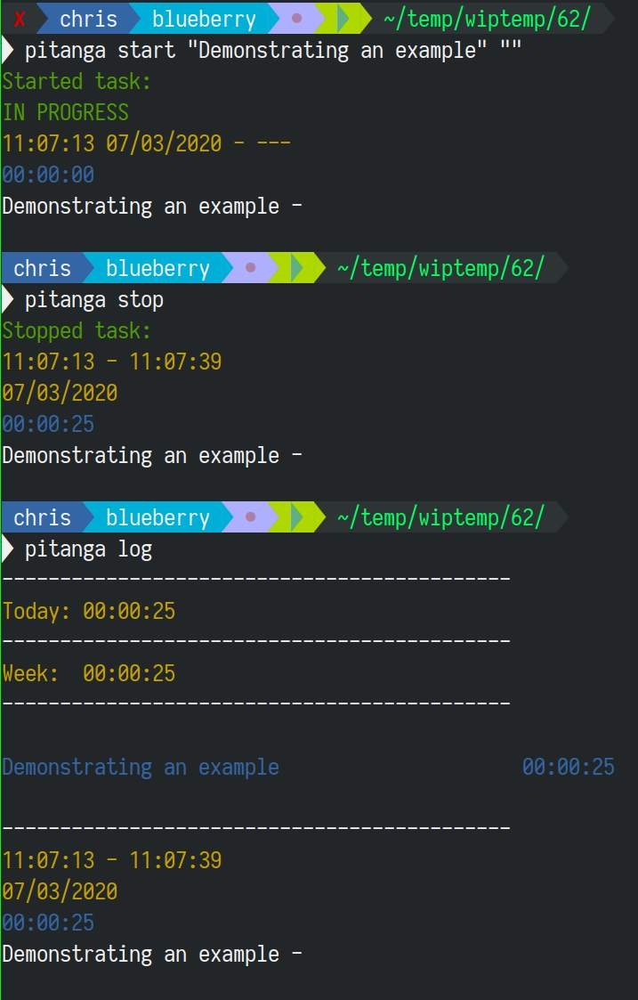

# PlatinumPitanga

An efficient cli time tracking application.

- Influenced by `git log`
- Storage in a simple `log.json` file in the current directory
- Colored syntax 
- Export functionality
- Two views, individual entries, or a more general overview where tasks are grouped by day.



## What problems does this solve?

It adds efficiency to logging time - minimizing keystrokes compared to every other time tracking software I've tried.
It adds efficiency to viewing log history.

## Examples 


Start a task:
```
$ pitanga start "Demonstrating an example" ""
Started task:
IN PROGRESS
11:07:13 07/03/2020 - ---
00:00:00 
Demonstrating an example - 
```

Stop a task:
```
$ pitanga stop
Stopped task:
11:07:13 - 11:07:39
07/03/2020
00:00:25 
Demonstrating an example - 
```

View the log:
```
pitanga log
--------------------------------------------
Today: 00:00:25 
--------------------------------------------
Week:  00:00:25 
--------------------------------------------

Demonstrating an example                     00:00:25 

--------------------------------------------
11:07:13 - 11:07:39
07/03/2020
00:00:25 
Demonstrating an example - 
```

View the log grouped by day:
```
pitanga log --first=20 --group-by "1d"
```

```
Mon:   01:00:22 ██
Tue:      25:56 ▌
Wed:      08:49 
Thu:   01:20:59 ██▎
Fri:   02:47:19 █████▎
Sat:      00:00 
--------------------------------------------
Today:    00:00 
--------------------------------------------
Week:  05:43:29 ▎
--------------------------------------------

investigate nginx starting correctly on boo     00:01 
fail2ban                                        18:53 ▎
general investigation                           19:02 ▎
logging outgoing connections                    49:03 █▎
addition of deploy-at-boot systemd unit         55:10 █▌
cron for sync                                01:10:03 ██
travis v2 deploy investigate                 02:11:13 ████

--------------------------------------------
02:47:19 | 2020-08-07
   01:38 | travis v2 deploy investigate
   00:02 | travis v2 deploy investigate
   23:26 | travis v2 deploy investigate
   13:51 | fail2ban
   05:02 | fail2ban
   00:13 | logging outgoing connections
   20:10 | logging outgoing connections
   24:19 | logging outgoing connections
   04:20 | logging outgoing connections
   00:01 | investigate nginx starting correctly on boot
   01:17 | addition of deploy-at-boot systemd unit
   53:52 | addition of deploy-at-boot systemd unit
   12:07 | general investigation
   06:54 | general investigation

01:20:59 | 2020-08-06
   01:39 | cron for sync
   32:29 | cron for sync
   18:00 | cron for sync
   09:05 | cron for sync
   05:42 | travis v2 deploy investigate
   14:03 | travis v2 deploy investigate
```


## What are the limitations?

- It saves the data in a single log.json file - so could be deleted by accident? Make frequent backups!
- No timezone support (everything is done in UTC).

## Instructions

```
pitanga --help
PlatinumPitanga

Usage: pitanga (COMMAND | COMMAND | COMMAND | COMMAND | COMMAND)

Available options:
  -h,--help                Show this help text

Available commands:
  start                    Start a new task
  stop                     Stop the task that is currently in progress
  resume                   Resume the last stopped task
  log                      Log
  export                   Export
```

```
pitangaLog --help 
Usage: pitanga log ([--first ARG] | [--last ARG])
  Log

Available options:
  --first ARG              show first n
  --last ARG               show last n
  -h,--help                Show this help text

```

```
pitanga export --help
Usage: pitanga export [--raw-json] [--group-by-day] [--group-by-day-and-task]
                      [--from ARG]
  Export

Available options:
  --raw-json               Export raw values as JSON
  --group-by-day           Sum aggregate group by day
  --group-by-day-and-task  Sum aggregate group by day and task
  --from ARG               dd mm yy
  -h,--help                Show this help text

```

## Installation

```
nix-build -A platinumpitanga.components.exes.pitanga
```

I think the nix build is broken. Have been using stack instead:
```
stack build
```


# Workflow 

** One word: FZF **

These aliases are highly recommended:
```
alias ptl="pitanga log --last 5 | less -R"
pts () {
  echo "$#"
  if [[ "$#" = 0 ]]; then
    pitanga start "$(cat tasks.txt | fzf)" ""
  else
    pitanga start "$(cat tasks.txt | fzf)" "$@"
  fi
};
alias ptsp="pitanga stop"
alias ptr="pitanga resume"
```

I have each "project" in a directory, and within each directory I have a helper `tasks.txt` file.

For example `tasks.txt` might have the contents of:

```
work on abc
investigate xyz
etcxyz
```
